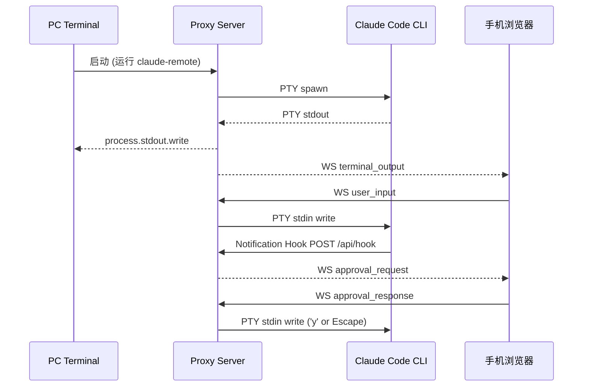

<!-- auto-doc: 新增领域/层/路由/外部集成时更新 -->
# Claude Code Remote Architecture

## 1. Context
> 局域网 PTY 代理层，手机浏览器远程查看输出、发送指令、审批 Claude Code 工具调用

- Users: PC 开发者（终端直接使用）、手机用户（浏览器远程控制）
- External Systems: Claude Code CLI（通过 PTY 启动）、Claude Code Notification Hook（审批通知）
- Boundaries: 仅支持局域网，不做公网穿透；不修改 Claude Code 本身；MVP 阶段不启用 TLS

### Domain Dictionary
| 术语 | 含义 |
|------|------|
| PTY | 伪终端，node-pty 管理的 Claude Code 子进程 |
| OutputBuffer | 环形缓冲区，存储 PTY 原始 ANSI 输出用于重连恢复 |
| Hook | Claude Code 内置的 Notification hook，审批时触发 HTTP POST |
| Approval | 工具调用审批请求/响应，手机端决策后通过 PTY 写入按键 |
| Terminal Relay | PC 终端 stdin/stdout 与 PTY 的 raw mode 透传 |
| Instance | 一个 claude-remote 进程，管理一个 PTY + Express + WS |
| Registry | ~/.claude-remote/instances.json 共享注册表，多实例发现 |
| Shared Token | ~/.claude-remote/token 共享认证令牌，多实例共用 |

## 2. Stack
- **Backend**: Node.js >= 20, TypeScript 5.7, Express 4, ws 8, node-pty 1, pino 9
- **Frontend**: React 19, Vite 6, xterm.js 5, Zustand 5, TypeScript 5.7
- **Shared**: TypeScript (ESM), WebSocket 消息协议类型
- **Build**: pnpm workspace monorepo, vitest 3
- **Deploy**: 单一 Node.js 服务，前端 build 后由 Express 静态文件服务

## 3. Layers

```
┌─ Frontend (React SPA) ──────────────────────────────┐
│  Pages → Components → Hooks → Stores → WS Client    │
│  InstanceTabs → useInstances → instance-store        │
└──────────────────────────────────────────────────────┘
                        ↕ WebSocket + REST
┌─ Backend (Node.js) ─────────────────────────────────┐
│  API Routes → Session Controller → PTY Manager       │
│                    ↕           ↕                     │
│              WS Server    Hook Receiver              │
│                    ↕                                 │
│            Output Buffer + Terminal Relay             │
│  Registry (shared-token + port-finder + instances)   │
└──────────────────────────────────────────────────────┘
                        ↕ PTY stdin/stdout
                  Claude Code CLI
```

- **API Routes**: REST 端点，参数验证，HTTP 响应
- **Session Controller**: 核心协调器，连接 PTY ↔ WS ↔ Terminal ↔ Hook
- **PTY Manager**: node-pty 进程生命周期，EventEmitter 模式
- **WS Server**: WebSocket 连接管理，Session Cookie 认证，心跳
- **Hook Receiver**: 接收 Claude Code Notification hook POST，生成 ApprovalRequest
- **Output Buffer**: 10K 行环形缓冲区，支持重连全量恢复
- **Terminal Relay**: PC 终端 raw mode stdin/stdout 直通 PTY
- **Registry**: 多实例管理基础设施——共享 Token、端口自动分配、实例注册表 (JSON 文件)

## 4. Data Flow



### 认证流程
1. 启动时获取共享 Token（优先级：AUTH_TOKEN 环境变量 > ~/.claude-remote/token > 自动生成）
2. 首次启动在 PC 终端完整显示 Token，后续实例提示 "(shared)"
3. 手机 POST `/api/auth` 提交 Token → `timingSafeEqual` 验证
4. 成功后签发 HttpOnly SameSite=Lax Session Cookie
5. WS 升级时验证 Cookie
6. 跨实例切换时前端用缓存 Token 对目标实例 POST /api/auth 重新认证

## 5. Routes

### Backend REST API
| Method | Path | Auth | Handler |
|--------|------|------|---------|
| POST | `/api/auth` | No | auth-routes.ts → AuthModule.handleAuth |
| GET | `/api/status` | Session | status-routes.ts → SessionController 状态 |
| GET | `/api/health` | No | health-routes.ts → 健康检查 |
| POST | `/api/hook` | Localhost only | hook-routes.ts → HookReceiver.processHook |
| GET | `/api/instances` | Session | instance-routes.ts → 注册表实例列表 + isCurrent 标记 |

### Backend WebSocket
| Direction | Path | Auth |
|-----------|------|------|
| Upgrade | `/ws` | Session Cookie |

### Frontend Pages
| Path | Component | 说明 |
|------|-----------|------|
| / | ConsolePage | 主控制台（需认证，否则显示 AuthPage）|

## 6. Domain Map

### PTY 代理
- backend: `pty/pty-manager.ts`, `pty/output-buffer.ts`, `terminal/terminal-relay.ts`
- backend: `session/session-controller.ts`

### 审批流程
- backend: `hooks/hook-receiver.ts`, `api/hook-routes.ts`
- backend: `session/session-controller.ts` (handleApprovalResponse)
- frontend: `components/approval/ApprovalCard.tsx`, `hooks/useApproval.ts`

### 认证
- backend: `auth/token-generator.ts`, `auth/auth-middleware.ts`, `auth/rate-limiter.ts`
- backend: `api/auth-routes.ts`
- frontend: `pages/AuthPage.tsx`, `hooks/useAuth.ts`, `services/api-client.ts`, `services/token-storage.ts`

### 实时终端
- backend: `ws/ws-server.ts`, `ws/ws-handler.ts`
- frontend: `components/terminal/TerminalView.tsx`, `hooks/useTerminal.ts`, `hooks/useWebSocket.ts`
- frontend: `components/input/InputBar.tsx`, `components/status/StatusBar.tsx`

### 多实例管理
- backend: `registry/shared-token.ts`, `registry/port-finder.ts`, `registry/instance-registry.ts`, `registry/stop-instances.ts`
- backend: `api/instance-routes.ts`
- frontend: `components/instances/InstanceTabs.tsx`, `hooks/useInstances.ts`, `stores/instance-store.ts`, `services/instance-api.ts`
- shared: `instance.ts` (类型定义 + 常量)

### 共享协议
- shared: `ws-protocol.ts`, `constants.ts`, `instance.ts`

## 7. Key Decisions

| 决策 | 选择 | 原因 | 后果 |
|------|------|------|------|
| CLI 控制方式 | PTY 伪终端 (node-pty) | 保留 PC 终端原始体验 | 需要管理 PTY 生命周期 |
| 审批识别 | Notification Hook + PTY 按键 | 官方 hook 机制可靠 | 需用户配置 ~/.claude/settings.json |
| 前端终端 | xterm.js (disableStdin) | 只读渲染 + ANSI 支持 | 用户输入走独立 InputBar |
| 认证 | Token + Session Cookie | 简单安全，适合局域网 | 需 timingSafeEqual 防时序攻击 |
| 网络绑定 | 仅局域网 IP | 安全隔离 | 无 LAN IP 时 fallback 127.0.0.1 |
| TLS | MVP 不启用 | 局域网风险可控 | post-MVP 需补充 HTTPS |
| 多实例 | 多进程 + 共享注册表 | 每个项目独立进程，简单可靠 | 需 JSON 文件注册表 + 僵尸清理 |
| 跨实例认证 | 前端缓存 Token + 自动 POST | Cookie 不区分端口但 Session 独立 | 切换时有一次认证延迟 |

详细 ADR: `docs/adrs/001-pty-plus-hooks.md`

## 8. Deployment

### Production
```bash
./scripts/build.sh          # shared → frontend → backend
node backend/dist/index.js  # 启动单一服务
```

### Development
```bash
pnpm dev                    # concurrently 启动前后端 dev server
pnpm stop                   # 按注册表停止本机所有实例（失败返回非 0）
```

### ENV vars
| 变量 | 默认值 | 说明 |
|------|--------|------|
| PORT | 3000 | 服务端口 |
| HOST | 自动检测 LAN IP | 绑定地址 |
| CLAUDE_COMMAND | claude | CLI 命令 |
| CLAUDE_ARGS | [] | CLI 额外参数 (JSON array) |
| CLAUDE_CWD | process.cwd() | Claude 工作目录 |
| AUTH_TOKEN | 共享 Token | 覆盖共享 Token（可选） |
| INSTANCE_NAME | CWD basename | 实例名称 |
| SESSION_TTL | 86400000 | Session 有效期 (ms) |
| AUTH_RATE_LIMIT | 5 | 认证限流（次/分钟/IP）|
| MAX_BUFFER_LINES | 10000 | 输出缓冲区最大行数 |
| LOG_DIR | ./logs | 日志目录 |
