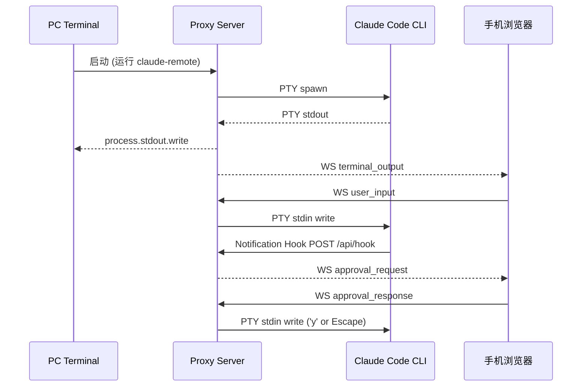

<!-- auto-doc: 新增领域/层/路由/外部集成时更新 -->
# Claude Code Remote Architecture

## 1. Context
> 局域网 PTY 代理层，手机浏览器远程查看输出、发送指令、审批 Claude Code 工具调用

- Users: PC 开发者（终端直接使用）、手机用户（浏览器远程控制）
- External Systems: Claude Code CLI（通过 PTY 启动）、Claude Code Notification Hook（审批通知）
- Boundaries: 仅支持局域网，不做公网穿透；不修改 Claude Code 本身；MVP 阶段不启用 TLS

### Domain Dictionary
| 术语 | 含义 |
|------|------|
| PTY | 伪终端，node-pty 管理的 Claude Code 子进程 |
| OutputBuffer | 环形缓冲区，存储 PTY 原始 ANSI 输出用于重连恢复 |
| Hook | Claude Code 内置的 Notification hook，审批时触发 HTTP POST |
| Approval | 工具调用审批请求/响应，手机端决策后通过 PTY 写入按键 |
| Terminal Relay | PC 终端 stdin/stdout 与 PTY 的 raw mode 透传 |
| Instance | 一个 PTY 实例，由 Daemon 进程内的 InstanceSession 管理 |
| InstanceManager | 管理所有 InstanceSession，进程内创建/销毁实例 |
| Daemon | 单进程多实例服务，固定端口 8866，管理所有 PTY 实例 |
| ActiveSource | 活跃端来源，决定终端窗口大小控制权：local（PC终端）/ webapp / attach |
| Shared Token | ~/.claude-remote/token 共享认证令牌，所有实例共用 |

## 2. Stack
- **Backend**: Node.js >= 20, TypeScript 5.7, Express 4, ws 8, node-pty 1, pino 9, qrcode-terminal
- **Frontend**: React 19, Vite 6, xterm.js 5, Zustand 5, TypeScript 5.7
- **Shared**: TypeScript (ESM), WebSocket 消息协议类型
- **Build**: pnpm workspace monorepo, vitest 3
- **Test**: vitest (unit), @testing-library/react (frontend), Playwright (e2e)
- **Deploy**: 单一 Node.js 服务，前端 build 后由 Express 静态文件服务

## 3. Layers

```
┌─ Frontend (React SPA) ──────────────────────────────┐
│  Pages → Components → Hooks → Stores → WS Client    │
│  InstanceTabs → useInstances → instance-store        │
└──────────────────────────────────────────────────────┘
                        ↕ WebSocket + REST
┌─ Backend (Node.js Daemon, port 8866) ──────────────────┐
│  API Routes → InstanceManager → InstanceSession(s)     │
│                    ↕                ↕                   │
│  WS Server (/ws/:instanceId)   PTY Manager             │
│                    ↕                ↕                   │
│              Hook Receiver    Output Buffer             │
│                                                        │
│  Shared Token + Terminal Relay + IP Monitor             │
└────────────────────────────────────────────────────────┘
                        ↕ PTY stdin/stdout
                  Claude Code CLI
```

- **API Routes**: REST 端点，参数验证，HTTP 响应
- **InstanceManager**: 管理所有 InstanceSession，进程内创建/销毁实例
- **InstanceSession**: 每个实例的协调器，管理 PTY ↔ WS clients ↔ Hook ↔ OutputBuffer + ActiveSource 状态
- **PTY Manager**: node-pty 进程生命周期，EventEmitter 模式
- **WS Server**: WebSocket 连接管理，按 `/ws/:instanceId` 路由到对应实例
- **Hook Receiver**: 接收 Claude Code Notification hook POST，按 instanceId 路由
- **Output Buffer**: 10K 行环形缓冲区，支持重连全量恢复
- **Terminal Relay**: PC 终端 raw mode stdin/stdout 直通 PTY，支持 pause/resume resize
- **Shared Token**: ~/.claude-remote/token 共享认证令牌

## 4. Data Flow



### 认证流程
1. 启动时获取共享 Token（优先级：AUTH_TOKEN 环境变量 > ~/.claude-remote/token > 自动生成）
2. 启动时在 PC 终端显示 Token 和 QR Code
3. 手机 POST `/api/auth` 提交 Token → `timingSafeEqual` 验证
4. 成功后签发 HttpOnly SameSite=Lax Session Cookie（固定名 `session_id`）
5. WS 升级时验证 Cookie 或 URL Token 参数
6. 所有实例同源同端口，一次认证覆盖所有实例

## 5. Routes

### Backend REST API
| Method | Path | Auth | Handler |
|--------|------|------|---------|
| POST | `/api/auth` | No | auth-routes.ts → AuthModule.handleAuth |
| GET | `/api/config` | Session | config-routes.ts → 全局 + 项目级合并配置（支持 ?instanceId 参数） |
| PUT | `/api/config` | Session | config-routes.ts → 更新配置（项目级字段保存到项目目录） |
| GET | `/api/status/:instanceId` | Session | status-routes.ts → InstanceSession 状态 |
| GET | `/api/health` | No | health-routes.ts → 健康检查 |
| POST | `/api/hook/:instanceId` | Localhost only | hook-routes.ts → InstanceSession.hookReceiver |
| POST | `/api/shutdown` | Localhost only | router.ts → 优雅关闭 daemon |
| GET | `/api/instances` | Session | instance-routes.ts → InstanceManager 实例列表 |
| GET | `/api/instances/config` | Session | instance-routes.ts → 工作目录列表 + 默认 Claude 参数 |
| POST | `/api/instances/create` | Session | instance-routes.ts → InstanceManager 进程内创建实例 |
| DELETE | `/api/instances/:instanceId` | Session | instance-routes.ts → 销毁实例 |
| GET | `/api/push/vapid-key` | Session | push-routes.ts → Web Push VAPID 公钥（可选功能） |
| POST | `/api/push/subscribe` | Session | push-routes.ts → 注册 Web Push 订阅（可选功能） |
| DELETE | `/api/push/subscribe` | Session | push-routes.ts → 注销 Web Push 订阅（可选功能） |

### Backend WebSocket
| Direction | Path | Auth |
|-----------|------|------|
| Upgrade | `/ws/:instanceId` | Session Cookie 或 URL Token 参数 |

### Frontend Pages
| Path | Component | 说明 |
|------|-----------|------|
| / | ConsolePage | 主控制台（已认证），AuthPage（未认证）|

## 6. Domain Map

### PTY 代理
**Backend** (`backend/src/pty/INDEX.md`):
- types.ts: IPtyManager 接口定义
- pty-manager.ts: 本地 PTY 进程管理
- output-buffer.ts: 环形缓冲区
- virtual-pty.ts: 远程 PTY 代理（attach 命令）

**Backend** (其他):
- terminal/terminal-relay.ts: PC 终端 stdin/stdout 透传
- instance/instance-manager.ts: 多实例管理器（Map<instanceId, InstanceSession>）
- instance/instance-session.ts: 单实例协调器（PTY + WS clients + Hook + OutputBuffer）
- attach.ts: attach 命令入口
- daemon/daemon-client.ts: CLI → daemon 通信（创建实例、停止等）
- update.ts: update 命令——检测包管理器 + 查询 npm registry + 执行全局更新

### Hook 通知
**Backend**:
- hooks/hook-receiver.ts: Hook 接收器
- api/hook-routes.ts: `/api/hook/:instanceId` 端点
- instance/instance-session.ts: notification → status broadcast to WS clients

权限审批通过 xterm 终端直接交互，无专属前端 UI

### 认证
**Backend** (`backend/src/auth/INDEX.md`):
- auth-middleware.ts: AuthModule 类（Token 验证 + Session Cookie）
- rate-limiter.ts: 速率限制
- token-generator.ts: 安全随机 Token 生成

**Backend**:
- api/auth-routes.ts: `/api/auth` 端点

**Frontend** (`frontend/src/services/INDEX.md`, `frontend/src/hooks/INDEX.md`):
- pages/AuthPage.tsx: 认证页面
- hooks/useAuth.ts: 认证 hook
- services/api-client.ts: API 客户端
- services/token-storage.ts: Token 持久化

### 项目级配置
**Backend** (`backend/src/config.ts`):
- WorkdirConfig: 项目级配置类型定义（shortcuts/commands 等）
- loadWorkdirConfig(): 加载 <cwd>/.claude-remote/settings.json
- saveWorkdirConfig(): 保存项目级配置
- mergeConfigs(): 合并全局配置 + 项目级配置

**Backend**:
- api/config-routes.ts: GET/PUT `/api/config` 支持 instanceId 参数，隔离实例级配置

### 实时终端
**Backend** (`backend/src/ws/`):
- ws-server.ts: WebSocket 服务端
- ws-handler.ts: 消息处理器

**Frontend** (`frontend/src/components/INDEX.md`, `frontend/src/hooks/INDEX.md`):
- components/terminal/TerminalView.tsx: xterm.js 容器
- components/terminal/ScrollToBottomButton.tsx: 滚动到底部按钮
- hooks/useTerminal.ts: Terminal 生命周期
- hooks/useWebSocket.ts: WS 连接管理
- components/input/InputBar.tsx: 输入栏
- components/status/StatusBar.tsx: 状态栏

### 多实例管理
**Backend** (`backend/src/instance/INDEX.md`):
- instance-manager.ts: InstanceManager，Map<instanceId, InstanceSession> 管理所有实例
- instance-session.ts: InstanceSession，单实例协调器（PTY + WS + Hook + Buffer）+ ActiveSource 管理

**Backend** (`backend/src/registry/INDEX.md`):
- shared-token.ts: 共享 Token
- stop-instances.ts: daemon 停止入口（委托 daemon-client API）

**Backend** (`backend/src/daemon/INDEX.md`):
- daemon-client.ts: CLI 与 daemon 通信（健康检查、创建实例、停止等）

**Backend** (`backend/src/utils/INDEX.md`):
- utils/ip-monitor.ts: IP 变化检测 + 广播通知

**Backend**:
- api/instance-routes.ts: 实例 API 端点

**Frontend** (`frontend/src/components/INDEX.md`, `frontend/src/hooks/INDEX.md`, `frontend/src/services/INDEX.md`):
- components/instances/InstanceTabs.tsx: 实例切换栏
- components/instances/CreateInstanceModal.tsx: 创建实例对话框
- hooks/useInstances.ts: 实例轮询
- stores/instance-store.ts: 实例状态
- services/instance-api.ts: 实例 API
- services/instance-create-api.ts: 创建实例 API

**Shared** (`shared/src/INDEX.md`):
- instance.ts: 类型定义 + 常量

### 外部通知
**Backend** (`backend/src/notification/INDEX.md`):
- dingtalk-service.ts: 钉钉群机器人 Webhook 通知服务
- wechat-work-service.ts: Server酱微信通知服务（SCT/sctp 双格式）

**Backend**:
- api/config-routes.ts: 通知配置 API（配置读取/更新，多渠道合并）
- instance/instance-session.ts: 需要输入时触发各渠道通知
- hooks/hook-receiver.ts: ALL_CHANNELS 定义通知渠道列表

**Frontend**:
- components/settings/SettingsModal.tsx: 通知配置管理
- components/settings/DingtalkConfigForm.tsx: 钉钉 Webhook 配置
- components/settings/WechatWorkConfigForm.tsx: Server酱³ API URL 配置

**Shared**:
- notification-types.ts: 多渠道通知类型定义、验证、迁移工具

### Skill 扫描
**Backend** (`backend/src/skills/INDEX.md`):
- skill-scanner.ts: 扫描全局 ~/.claude/skills/ 和项目级 .claude/skills/ 目录
- skill-commands.ts: 将 Skill 转换为 ConfigurableCommand
- skill-command-merger.ts: 智能合并现有 commands 和新 Skill commands

**Backend**:
- api/config-routes.ts: GET /api/config 时合并 Skill commands 到返回结果

### 推送通知
**Backend**:
- push/push-service.ts: Web Push 服务

**Frontend** (`frontend/src/hooks/INDEX.md`):
- hooks/usePushNotification.ts: Web Push 订阅
- hooks/useLocalNotification.ts: 本地通知

### 共享协议
**Shared** (`shared/src/INDEX.md`):
- ws-protocol.ts: WebSocket 消息协议
- constants.ts: 共享常量
- instance.ts: 实例类型
- defaults.ts: 默认快捷键/命令

### API 路由
**Backend** (`backend/src/api/INDEX.md`):
- router.ts: 路由聚合器
- auth-routes.ts, config-routes.ts, health-routes.ts, hook-routes.ts
- instance-routes.ts, push-routes.ts, status-routes.ts

### E2E 测试
**E2E** (`e2e/INDEX.md`):
- fixtures/: 全局启动/停止基座
- helpers/: 截图、选择器、等待工具
- tests/: 6 个核心场景回归测试

## 7. Key Decisions

| 决策 | 选择 | 原因 | 后果 |
|------|------|------|------|
| CLI 控制方式 | PTY 伪终端 (node-pty) | 保留 PC 终端原始体验 | 需要管理 PTY 生命周期 |
| 审批识别 | Notification Hook + PTY 按键 | 官方 hook 机制可靠 | 需用户配置 ~/.claude/settings.json |
| 前端终端 | xterm.js (disableStdin) | 只读渲染 + ANSI 支持 | 用户输入走独立 InputBar |
| 认证 | Token + Session Cookie | 简单安全，适合局域网 | 需 timingSafeEqual 防时序攻击 |
| 网络绑定 | 仅局域网 IP | 安全隔离 | 无 LAN IP 时 fallback 127.0.0.1 |
| TLS | MVP 不启用 | 局域网风险可控 | post-MVP 需补充 HTTPS |
| 多实例 | 单进程多实例 (Daemon) | 资源共享、无跨端口通信、一次认证 | 首实例退出不影响 daemon |
| 实例路由 | WS/Hook 按 instanceId 路径路由 | 同端口同源，前端无跨域问题 | URL 包含 instanceId |

详细 ADR: `docs/adrs/001-pty-plus-hooks.md`

## 8. Deployment

### Production
```bash
./scripts/build.sh          # shared → frontend → backend
node backend/dist/index.js  # 启动单一服务
```

### Development
```bash
pnpm dev                    # concurrently 启动前后端 dev server
pnpm stop                   # 向 daemon 发送 shutdown 请求
```

### Testing
```bash
# 后端单元测试
cd backend && pnpm test -- tests/unit/pty/output-buffer.test.ts

# 前端单元测试
cd frontend && pnpm test

# E2E 测试（独立包，不在 workspace 内）
cd e2e && npm install && npx playwright install chromium
cd e2e && npx playwright test                    # 全部运行
cd e2e && npx playwright test tests/01-auth.spec.ts  # 单个文件

# 类型检查
cd backend && npx tsc --noEmit
cd frontend && npx tsc --noEmit
```

### ENV vars
| 变量 | 默认值 | 说明 |
|------|--------|------|
| PORT | 8866 | 服务端口（固定） |
| HOST | 自动检测 LAN IP | 绑定地址 |
| CLAUDE_COMMAND | claude | CLI 命令 |
| CLAUDE_ARGS | [] | CLI 额外参数 (JSON array) |
| CLAUDE_CWD | process.cwd() | Claude 工作目录 |
| AUTH_TOKEN | 共享 Token | 覆盖共享 Token（可选） |
| INSTANCE_NAME | CWD basename | 实例名称 |
| SESSION_TTL | 86400000 | Session 有效期 (ms) |
| AUTH_RATE_LIMIT | 5 | 认证限流（次/分钟/IP）|
| MAX_BUFFER_LINES | 10000 | 输出缓冲区最大行数 |
| LOG_DIR | ./logs | 日志目录 |

### Project Structure
```
claude-code-remote/
├── shared/                  # 前后端共享 TypeScript 类型
├── backend/                 # Node.js + Express + ws + node-pty
│   └── src/
│       ├── cli.ts           # CLI 入口（动态 import 确保 CLI_MODE 早于 logger 加载）
│       ├── cli-utils.ts     # CLI 参数解析工具函数
│       ├── update.ts        # update 子命令（自动检测 npm/pnpm 并更新）
│       ├── index.ts         # 服务入口
│       ├── api/             # REST API 路由
│       ├── auth/            # Token 验证、Session Cookie
│       ├── daemon/          # CLI → daemon 通信客户端
│       ├── hooks/           # Claude Code Hook 接收器
│       ├── instance/        # InstanceManager + InstanceSession（核心多实例管理）
│       ├── notification/    # 钉钉等外部通知服务
│       ├── pty/             # PTY 进程管理
│       ├── registry/        # 共享 Token、daemon 停止工具
│       ├── skills/          # Skill 扫描与 Command 转换
│       ├── terminal/        # PC 终端 raw mode 透传
│       ├── utils/           # 工具函数（二维码、IP 监控等）
│       └── ws/              # WebSocket 服务端
├── frontend/                # React 19 + Vite + xterm.js
│   └── src/
│       ├── pages/           # AuthPage / ConsolePage
│       ├── components/      # UI 组件（终端、输入、设置、引导等）
│       ├── hooks/           # React hooks
│       └── stores/          # Zustand 状态管理
└── e2e/                     # Playwright 端到端测试
```
